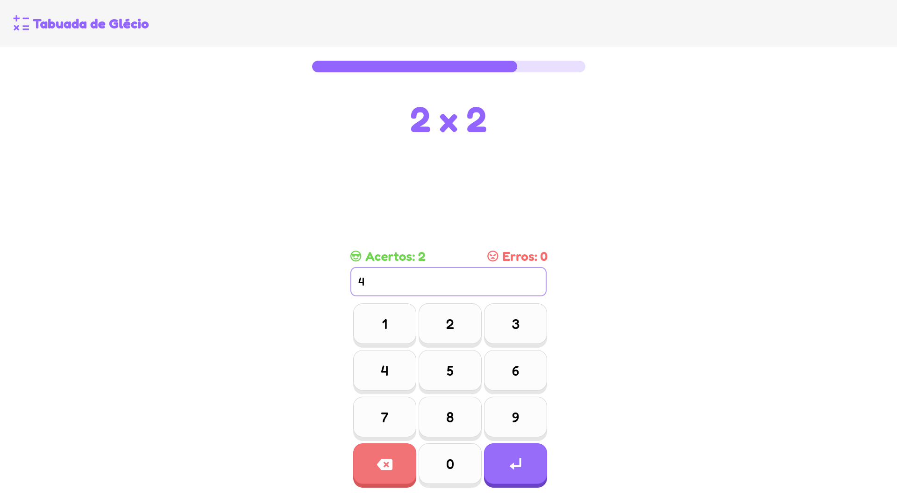

# Projeto Tabuada

Esse site/jogo foi desenvolvido com o intuito de ajudar os alunos da EEEP Elsa Maria Porto Costa Lima a dominarem a tabuda, e consequentemente, tirarem uma nota boa teste do professor Glécio. Veja o preview [jogue clicando aqui](https://ldavi05.github.io/projeto-tabuada/)

# Contribuidores

